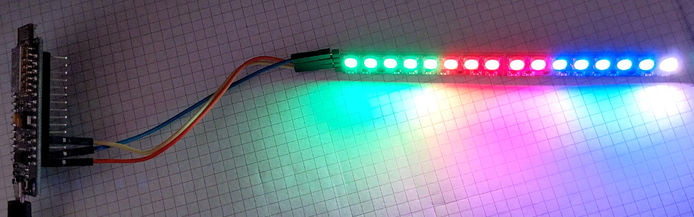
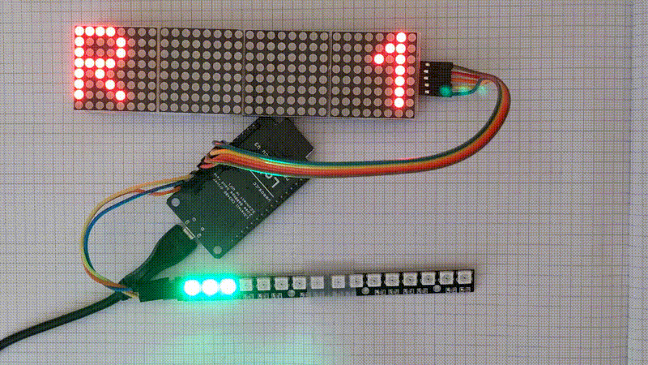
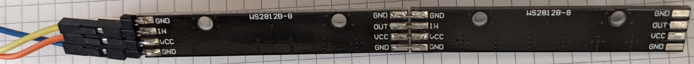
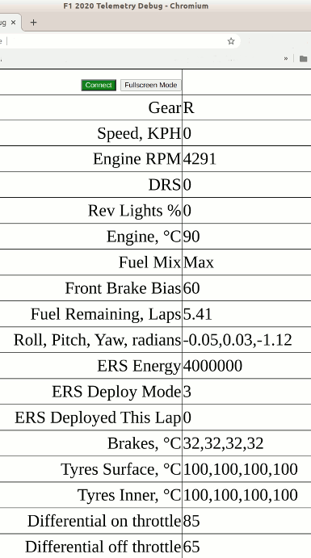

# Car Racing Simulation UDP Telemetry

Popular car racing simulators send car telemetry via UDP packets. This allows
third party programs and devices to access real-time information such as engine
speed, RPM, temperature, etc.

The repo has some examples using an ESP8266 to drive LEDs based on RPM. Two
games are supported: "Project Cars 2" and "F1 2020".

## Dependencies

### NodeMCU 1.0 Pin Map

https://github.com/nodemcu/nodemcu-devkit-v1.0#pin-map

### WiFi Manager Library

Use your phone or tablet to enter your SSID and password. No need to change
the source code.

https://github.com/tzapu/WiFiManager

### NeoPixelBus Library

This library has ESP8266 specific optimizations WS2812 LEDs.

https://github.com/Makuna/NeoPixelBus

### MAX72xx Library

This library is used to drive the 32x8 LED matrix.

https://github.com/MajicDesigns/MD_MAX72XX

### The Project Cars 2 API

https://www.projectcarsgame.com/two/project-cars-2-api/

### F1 2020 API

https://forums.codemasters.com/topic/50942-f1-2020-udp-specification/

## Hardware

Parts

Quantity    |Description
------------|-----------
1           |NodeMCU 1.0 ESP8266 board
2           |8 RGB LED stick
3           |Wires
n/a         |Solder

Connection Table for RGB LEDs

NodeMCU     |WS2812     |Description
------------|-----------|-----------
G           |GND        |Ground (Blue wire)
3V3         |VCC        |3.3 Volt Power (Orange wire)
RX          |IN         |Arduino GPIO#3 (Yellow wire)

Connecting the WS2812 LEDs this way may not always work because the LEDs are
designed for 5 Volt power and logic levels. But 3.3 Volt works on most of the
time. And this eliminates the need for logic level converters. If you want
maximum brightness, use 5 Volts and logic level converters. The number
of LEDs is limited by the ESP8266 board 3.3V voltage regulator.

The two 8 RGB sticks are soldered together to form one 16 RGB stick. Flexible
strips and rings can be used instead.

Connection Table for 32x8 LED matrix

NodeMCU ESP8266    |LED Matrix  |Description
-------------------|------------|------------
3V3                |VCC         |3.3 Volt power
GND                |GND         |Ground
D7,GPIO#13,HMOSI   |DIN         |SPI output
D8,GPIO#15,HCS     |CS          |SPI select
D5,GPIO#14,HSCLK   |CLK         |SPI clock

## Project Cars 2 RGB LEDs Example

./pcars2/pcars2leds/pcars2leds.ino

Drive 16 WS2812 RGB LEDs based on engine RPM.

## Project Cars 2 LED Matrix Example

./pcars2/pcars2matrix/pcars2matrix.ino

Drive 32x8 LED matrix based on gear and KPH. Also drive 16 WS2812 RGB LEDs
based on engine RPM.

## F1 2020 RGB LED Example

./f12020/f12020leds/f12020leds.ino

Drive 16 WS2812 RGB LEDs based on rev lights percent.

## F1 2020 LED Matrix Example

./f12020/f12020matrix/f12020matrix.ino

Drive 32x8 LED matrix based on gear and KPH. Also drive 16 WS2812 RGB LEDs
based on rev lights %. The ESP8266's IP address is displayed on power up
on the 32x8 matrix. The IP address must be plugged into the F1 2020 UDP
configuration screen. The screen is cleared when the first UDP packet is
received.

Now includes a web interface for showing various telemetry results including

* Front brake bias
* Fuel mix
* DRS
* Engine temperature
* ERS
* Tire temperatures
* Orientation (Roll, pitch, yaw)

Connect to the ESP8266's IP address to see the web page. The web page is pure
text for debugging but it could be decorated with graphics if desired.

